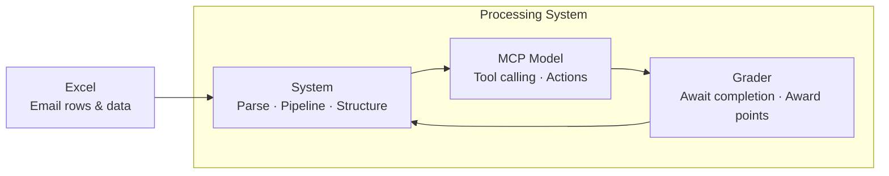
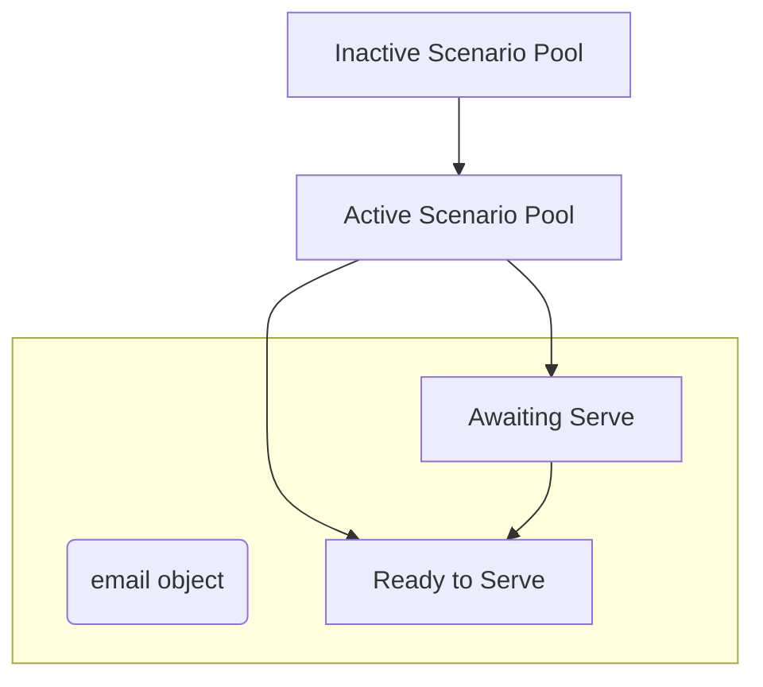

**Miguel**

1) Create API documentation for the tools. This will be read by the model to understand its available tools on how to interact with out system.
2) Initialize research on MCP via CLI call. MCP Model should read avaialable tools and system prompt for task. Allow functionality to expect Email objects and act accordingly. *Implement whatever possible*.

**Nikita**, **Eyasu**, **Nalu**, **Anthony**

1) Context: Levrage off of createed CLI-Excel injestion system previosuly created using the following for testing:
```
https://uoregon.sharepoint.com/:x:/r/sites/O365_AISU/_layouts/15/Doc.aspx?sourcedoc=%7B642ACACE-665E-4465-A2C1-978840C8DB79%7D&file=Emails.xlsx&wdLOR=c72B91A6C-2FFE-B440-9D37-5A7512FA2E6F&fromShare=true&action=default&mobileredirect=true
```
Validate structure then parse by processing each row into models, fitting every field into the object's attributes. *Note that the structure is a bit different than what was promised.*

2) Simulate model-to-email interaction. This could be via placeholder void function that sleeps for a few seconds. The purpose of this is to replicate the model's interaction cycle for an iteration.

3) Sample a fair amount of emails per day considering a total 100 day window. Serve these already-parsed email object array into the placeholder function as a parameter. This will be the main iterative pipeline between input and model.

2) All emails are associated with a Scenario ID (currently known as Scenario Type by non-tech). This can range from standalone one-email chains, to multiple emails (currently up to five). Every time a an email with an associated chain of emails is being served for the iteration, move the corresponding scenario/chain into an `active scenario` pool. Otherwise have them be in the `inactive scenario` pool.

4) Parse success criteria into actioanable arrays. Have a separate system that will gather success criteria after every iteration for that day. The system will check that the action/task was met by using the already-created tools (from Week 2). If successful, award 1 point.
*Note: This is meant to be vague and incomplete. Don't spent a ton of time on this as this is a critical step to our simulation and it still needs to be thought out*

5) At the time of serving email objects for every iteration keep track of current date and replace the Email Object's timestamp tag with the current date. After every iteration, increase the date count.

The following is a represenation of the pipeline and overall interaction between the sample emails per iteration into the model via MCP tool calling.

The following represents the pooling system:


Ask Daniel or John any questions about the system. Collaboarte with each other.
